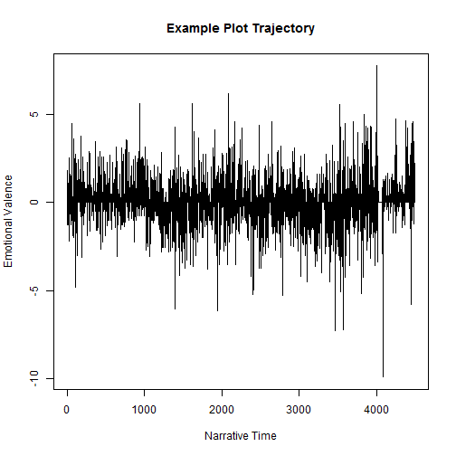

Online Sentiment Analisys 
========================================================
author: Jose Gustavo Z. Rosa
date: march/2017
autosize: true

Experiment
========================================================

The App concept is to experiment a Shiny App with R Studio
using some data to process something.

Based on it, I decided to use the Project Gutemberg as a data source.
To do So, I tried at first to use the *rVest* package to download and process the HTML into a plain text file.

Due SSL Limitations on the Shinny.io enviroment I download a few books
and use it as a data source.


The Concept
========================================================


```r
summary(cars)
```

```
     speed           dist       
 Min.   : 4.0   Min.   :  2.00  
 1st Qu.:12.0   1st Qu.: 26.00  
 Median :15.0   Median : 36.00  
 Mean   :15.4   Mean   : 42.98  
 3rd Qu.:19.0   3rd Qu.: 56.00  
 Max.   :25.0   Max.   :120.00  
```

Slide With Plot
========================================================


