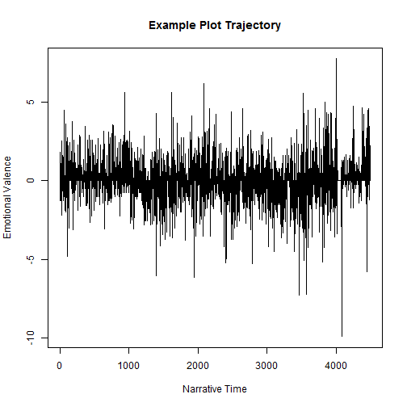

Online Sentiment Analisys 
========================================================
author: Jose Gustavo Z. Rosa
date: march/2017
autosize: true

Experiment
========================================================

The App concept is to experiment a Shiny App with R Studio
using some data to process something.

Based on it, I decided to use the Project Gutemberg as a data source.
To do So, I tried at first to use the *rVest* package to download and process the HTML into a plain text file.

Due SSL Limitations on the Shinny.io enviroment I download a few books
and use it as a data source.

The Concept
========================================================

The Key Point is to select one Book, our load a new book from www.gutemberg.org
and them using the syhuzet R packge extrat the "tone"/"emotional" variance thru the book time line. 

Slide With Plot
========================================================

